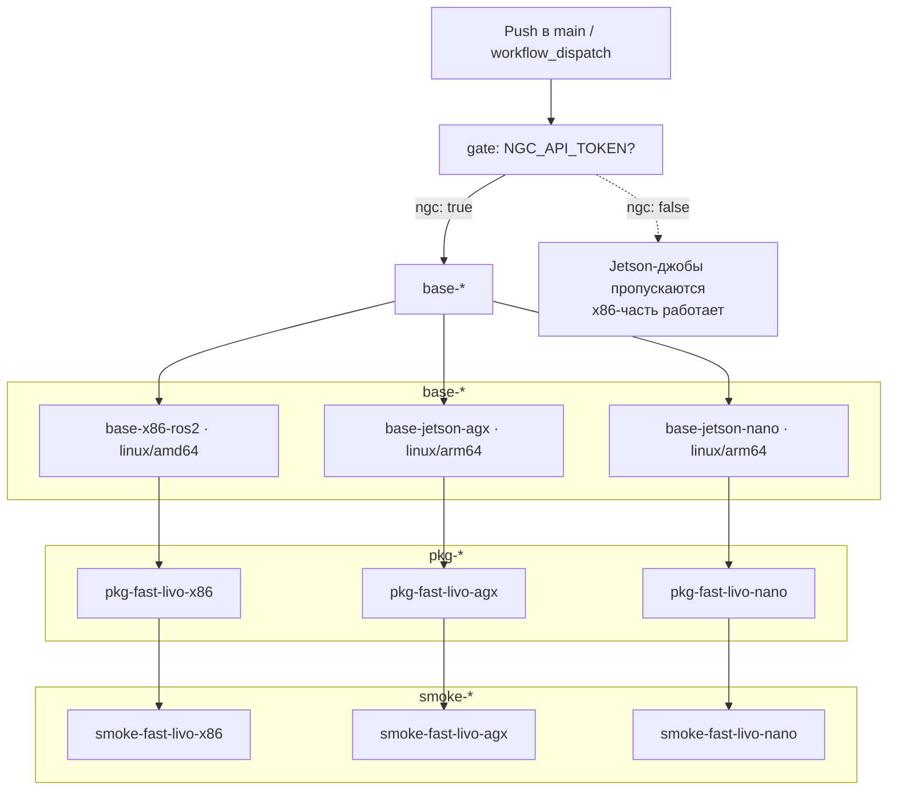

# Архитектура системы

## Обзор

Система держится на трёх частях:

1. **Базовые Docker-образы**: ОС + CUDA + ROS2 Humble
2. **Шаблон сборки пакета**: один Dockerfile (`colcon build`) для ROS2-пакетов
3. **CI/CD пайплайн**: единый workflow GitHub Actions

## Структура

```
ros2-cuda-docker/
├── .github/workflows/
│   └── ci.yml                    # Единый CI/CD пайплайн
├── docker/
│   ├── base/                     # Единый базовый Dockerfile
│   │   └── Dockerfile.ros2       # ARG BASE_IMAGE (CUDA / L4T)
│   └── package/                  # Шаблон сборки пакетов
│       └── Dockerfile.ros2       # colcon build
├── scripts/                      # Вспомогательные скрипты
│   ├── build-local.sh            # Локальная сборка базовых образов
│   ├── verify-cuda.sh            # Проверка CUDA/ROS в образе
│   └── push-images.sh            # Публикация базовых образов в registry
└── docs/                         # Документация
```

Назначение и опции скриптов: [Скрипты](SCRIPTS.md).

## Базовые образы

Все три таргета собираются из одного `docker/base/Dockerfile.ros2`; различие задаётся `ARG BASE_IMAGE` (CUDA-образ для x86, L4T JetPack для Jetson), имена и SHA-теги задаются `metadata-action` в CI.

### x86_64

```
nvidia/cuda:12.6.3-devel-ubuntu22.04
    ├── CUDA Toolkit 12.6.3
    ├── ROS2 Humble
    ├── PCL, Eigen, OpenCV
    └── colcon
```

### Jetson AGX Orin и Orin Nano (JP 6.2)

```
nvcr.io/nvidia/l4t-jetpack:r36.4.0
    ├── L4T R36.4.0 (Ubuntu 22.04)
    ├── CUDA из JetPack
    ├── ROS2 Humble
    └── PCL, Eigen, OpenCV
```

Оба Jetson-таргета используют одну базу `r36.4.0` (JP 6.2): тегов под «JP 7 / Orin Nano» в registry нет.

## CI/CD пайплайн

Единый workflow `.github/workflows/ci.yml`. Триггеры: push в `main`, `workflow_dispatch`.



Зависимости связываются через `needs:` + outputs `gate`; образы строятся `docker/build-push-action@v5`. Пошагово, что делает каждая джоба: [CI/CD пайплайн: детальный разбор](CI_PIPELINE.md).

## Инженерные решения

| Решение | Обоснование и trade-offs |
|---|---|
| **Один workflow вместо трёх** | Отдельные workflow с `workflow_run` дают гонки и запутанный граф событий. Единый `ci.yml` с `needs:` задаёт явный граф зависимостей, который видно в одном месте. Цена в том, что всё лежит в одном файле, но на этом масштабе это приемлемо. |
| **Гейтинг Jetson через `gate`** | `nvcr.io` требует авторизацию. Джоба `gate` проверяет наличие `NGC_API_TOKEN` и выводит `ngc`; у Jetson-джоб стоит `if: needs.gate.outputs.ngc == 'true'`, поэтому без токена они получают статус `skipped`, а не `failed`, и x86-часть пайплайна выполняется без изменений. |
| **`base-*` → `pkg-*` → `smoke-*`** | Пакет собирается только поверх опубликованной базы (а не локального слоя), поэтому каждый артефакт в ghcr гарантированно согласован с зависимостями. Smoke-стадия запускает тот же опубликованный образ, который потребуется потребителю, поэтому проверка проходит по реальному пути использования. |
| **Кеш `type=gha` со scope** | Кеш-ключи привязаны к платформенной паре (`base-x86_64-ros2`, `pkg-fast_livo-jetson-agx-ros2` и т.д.), поэтому параллельные ветки не загрязняют кеш друг друга. Холодная сборка Jetson-пакета занимает 40-60 минут (QEMU), с кешем минуты. |
| **Кросс-сборка ARM64 через QEMU** | Позволяет публиковать Jetson-образы без ARM-раннеров, а нативных ARM64-раннеров в GitHub Actions нет на всех планах. QEMU медленнее нативной сборки, поэтому ARM64 собирается только в стадиях публикации; разработка ведётся на x86. |
| **Единый шаблон пакета `Dockerfile.ros2` (Humble)** | Один шаблон с `build-args` (репо, ветка, имя, `CUDA_ARCH`, `ROS_DISTRO`) убирает дублирование и делает добавление пакета декларативным. |
| **Запин базовых образов** | Версии зафиксированы (`cuda:12.6.3-devel-ubuntu22.04`, `l4t-jetpack:r36.4.0`), а не `:latest`, ради воспроизводимости сборок. Плата за это: обновление баз выполняется явным PR, а не автоматически. |

## Security

- Jetson-сборки требуют `secrets.NGC_API_TOKEN`; секрет не логируется (передаётся через `env` джобы).
- `GITHUB_TOKEN` используется только в скоупе `permissions: { contents: read, packages: write }` (минимально необходимый набор прав).
- Публикация в `ghcr.io` по `linux/amd64` и `linux/arm64` идёт изолированно через `docker/login-action`; кросс-платформенные подмены исключены разделением `platforms`.

## Кросс-компиляция через QEMU

Jetson-образы (linux/arm64) собираются на x86-раннере под QEMU:

1. **QEMU** (`docker/setup-qemu-action`, `platforms: arm64`) регистрирует `binfmt_misc`
2. **Docker Buildx** (`docker-container`) выполняет multi-platform сборку
3. **L4T-контейнеры NVIDIA** (`nvcr.io/nvidia/l4t-jetpack`) предоставляют пользовательский слой для Orin

Сборка ARM64 под QEMU заметно медленнее нативной x86: холодный прогон пакета занимает 40-60 минут. Альтернативы, рассмотренные и отклонённые:

- **Нативные ARM64 раннеры**: быстрее, но платные и доступны не на всех планах GitHub; для периодических публикаций QEMU достаточно.
- **Готовые Arm-бинарники в репо**: отвергнуто, противоречит контракту «образ собирается из исходников» и усложняет верификацию.

## Регистр образов

Все образы публикуются в GitHub Container Registry (владелец пакетов `acider19`):

```
ghcr.io/acider19/ros-cuda-base:<platform>-ros2-latest
ghcr.io/acider19/ros-pkg:<package>-<platform>-ros2-latest
```

Примеры:
- `ghcr.io/acider19/ros-cuda-base:x86_64-ros2-latest`
- `ghcr.io/acider19/ros-cuda-base:jetson-agx-ros2-latest`
- `ghcr.io/acider19/ros-pkg:fast_livo-x86_64-ros2-latest`
- `ghcr.io/acider19/ros-pkg:fast_livo-jetson-agx-ros2-latest`