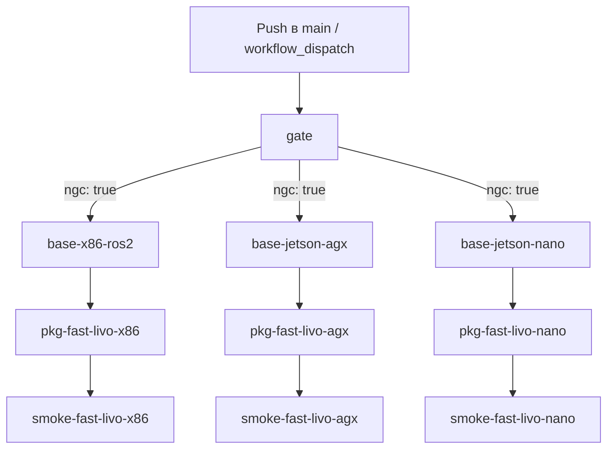

# CI/CD пайплайн: детальный разбор `ci.yml`

Workflow `.github/workflows/ci.yml` собирает базовые образы и пакеты и публикует их в ghcr. Здесь описан каждый этап: что делает та или иная джоба, какие шаги выполняет и какие артефакты даёт. Схема графа и архитектурные обоснования: [Архитектура системы](ARCHITECTURE.md).

## Триггеры и окружение

```yaml
on:
  push:
    branches: [main]
  workflow_dispatch:
```

Запуск по push в `main` и вручную (`Actions → CI → Run workflow`).

```yaml
permissions:
  contents: read
  packages: write
```

Права даны через `GITHUB_TOKEN`, отдельного PAT для публикации в ghcr нет.

Вершина workflow задаёт env:

| Переменная | Значение | Назначение |
|---|---|---|
| `REGISTRY` | `ghcr.io` | Куда публикуются образы |
| `BASE_PREFIX` | `<owner>/ros-cuda-base` | Репозиторий базовых образов |
| `PKG_PREFIX` | `<owner>/ros-pkg` | Репозиторий пакетов |
| `NGC_API_TOKEN` | `secrets.NGC_API_TOKEN` | Доступ к `nvcr.io` |
| `NGC_USERNAME` | `secrets.NGC_USERNAME` | Логин для `nvcr.io` (необязательно, есть fallback) |

## Граф джоб



Если токена нет, `ngc: false` и цепочка Jetson (`base-jetson-*`, их `pkg-*`, их `smoke-*`) получает `skipped`: джобы `pkg-*`/`smoke-*` не имеют собственного условия, они зависят от `base-*` через `needs`, а зависимая джоба пропускается автоматически, если зависимость скипнута. x86-цепочка выполняется всегда.

## gate

Проверяет наличие `secrets.NGC_API_TOKEN` и пишет результат в выходную переменную джобы:

```yaml
outputs:
  ngc: ${{ steps.check.outputs.ngc }}
```

`$GITHUB_OUTPUT` заполняется значениями `ngc=true` или `ngc=false`. Никакой оценки валидности токена нет, только факт присутствия. Джобы Jetson читают результат через `if: needs.gate.outputs.ngc == 'true'`.

## Базовые образы: `base-*`

Три джобы, одна платформа каждая. Шаги:

1. `actions/checkout@v4`: клонирует репозиторий.
2. `docker/setup-buildx-action@v3`: создаёт buildx-билдер (BuildKit).
3. `docker/setup-qemu-action@v3` (только Jetson): регистрирует `binfmt_misc`, чтобы на x86-раннере выполнялась arm64.
4. `docker/login-action@v3` (ghcr): вход под `github.actor` с паролем `GITHUB_TOKEN`. Публиковать в ghcr образы от имени репо можно именно потому, что у workflow есть `packages: write`.
5. `docker/login-action@v3` (только Jetson, `nvcr.io`): логин с именем `NGC_USERNAME || '$oauthtoken'` и паролем `NGC_API_TOKEN`. На `$oauthtoken` просто завязан доступ к приватному `l4t-jetpack`.
6. `docker/metadata-action@v5`: формирует теги и лейблы по шаблону.
7. `docker/build-push-action@v5`: собирает и пушит образ.

Отличия джоб:

| Джоба | Платформа | Теги | `BASE_IMAGE` | Кеш (scope) | QEMU | nvcr login |
|---|---|---|---|---|---|---|
| `base-x86-ros2` | `linux/amd64` нативно | `x86_64-ros2-latest` + SHA `x86_64-ros2-<sha>` | `nvidia/cuda:12.6.3-devel-ubuntu22.04` | `base-x86_64-ros2` | нет | нет |
| `base-jetson-agx` | `linux/arm64` под QEMU | `jetson-agx-ros2-latest` + SHA | `nvcr.io/nvidia/l4t-jetpack:r36.4.0` | `base-jetson-agx-ros2` | да | да |
| `base-jetson-nano` | `linux/arm64` под QEMU | `jetson-nano-ros2-latest` + SHA | `nvcr.io/nvidia/l4t-jetpack:r36.4.0` | `base-jetson-nano-ros2` | да | да |

SHA-тег привязан к SHA коммита (`type=sha`), по нему можно откатиться к известной версии базы. Оба Jetson-таргета собираются из одного и того же `l4t-jetpack:r36.4.0`, отличаются только тегами.

Все три джобы берут один Dockerfile `docker/base/Dockerfile.ros2`; различие передаётся `--build-arg BASE_IMAGE`.

## Пакеты: `pkg-*`

Собирают FAST-LIVO2 поверх опубликованных базовых образов (не локальных слоёв: каждый артефакт в ghcr согласован с зависимостями). Структура шагов повторяет `base-*`, Jetson-джобы опять с QEMU. Различия:

| Джоба | Платформа | Теги | Параметры сборки | Кеш (scope) |
|---|---|---|---|---|
| `pkg-fast-livo-x86` | `linux/amd64` | `fast_livo-x86_64-ros2-latest` | `CUDA_ARCH=70;75;80;86`, `ROS_DISTRO=humble` | `pkg-fast_livo-x86_64-ros2` |
| `pkg-fast-livo-agx` | `linux/arm64` | `fast_livo-jetson-agx-ros2-latest` | `CUDA_ARCH=87` | `pkg-fast_livo-jetson-agx-ros2` |
| `pkg-fast-livo-nano` | `linux/arm64` | `fast_livo-jetson-nano-ros2-latest` | `CUDA_ARCH=87` | `pkg-fast_livo-jetson-nano-ros2` |

Общие `build-args`: `BASE_IMAGE` (соответствующий `ghcr.io/<owner>/ros-cuda-base:<platform>-ros2-latest`), `PACKAGE_REPO=https://github.com/v4rl-ucy/FAST-LIVO2-ROS2.git`, `PACKAGE_BRANCH=main`, `PACKAGE_NAME=fast_livo`, `ROS_DISTRO=humble`.

У пакетов тегов только `*-latest`, без SHA: пакетные теги трактуются как «текущая версия поверх соответствующей базы», откат идёт по базе.

`pkg-fast-livo-x86` дополнительно делает шаг `Verify image`: после push ждёт 10 секунд и проверяет, что `docker manifest inspect` находит опубликованный манифест.

## Smoke-проверки: `smoke-*`

Запускают уже опубликованные образы и проверяют содержимое. Шаги:

1. `actions/checkout@v4`.
2. `docker/setup-qemu-action@v3` (только Jetson, чтобы запустить arm64-образ на x86-раннере).
3. `docker run --entrypoint bash <образ>` с набором проверок:

   - `dpkg --print-architecture` равен `amd64` на x86 или `arm64` на Jetson (Jetson-запуск с `--platform linux/arm64`);
   - существует бинарник `fast_livo`: `/colcon_ws/install/fast_livo/lib/fast_livo/fastlivo_mapping`;
   - существует узел драйвера: `/colcon_ws/install/livox_ros_driver2/lib/livox_ros_driver2/livox_ros_driver2_node`;
   - `import gtsam` выполняется в Python 3.

Ошибка в любом `test` прерывает джобу через `set -e`. Проверка всегда идёт по реальному пути: образ, который тянет потребитель.

## Кеш

Каждая джоба `build-push-action` задаёт пару:

```yaml
cache-from: type=gha,scope=<scope>
cache-to: type=gha,mode=max,scope=<scope>
```

`type=gha` хранит слои в кеше GitHub Actions, `mode=max` сохраняет и промежуточные слои (важно для `colcon build`). Скоп привязан к паре платформа+Dockerfile, ключ курсэйта включает базовый образ и содержимое Dockerfile, поэтому параллельные ветки не загрязняют кеш друг друга, а смена `BASE_IMAGE` или правки в Dockerfile инвалидируют его автоматически.

Следствие: холодная сборка Jetson-пакета под QEMU занимает 40-60 минут, повторная с кешем минуты (см. [Известные ограничения](KNOWN_LIMITATIONS.md), там же про редкие интермиттентные падения эмуляции с лечением через `Re-run failed jobs`).

## Что публикуется

| Репозиторий | Теги после прогона |
|---|---|
| `ghcr.io/<owner>/ros-cuda-base` | `x86_64-ros2-latest`, `jetson-agx-ros2-latest`, `jetson-nano-ros2-latest` + `-ros2-<sha>` варианты |
| `ghcr.io/<owner>/ros-pkg` | `fast_livo-x86_64-ros2-latest`, `fast_livo-jetson-agx-ros2-latest`, `fast_livo-jetson-nano-ros2-latest` |

## Примечания

- Предупреждения вида «Node 20 is being deprecated» в логах не влияют на результат: это системное уведомление GitHub о будущей миграции раннеров на другую версию Node.
- При ручном запуске без push ничего не меняется, джобы используют тот же checkout.
- Fixed версии баз (`cuda:12.6.3-devel-ubuntu22.04`, `l4t-jetpack:r36.4.0`) дают воспроизводимость; обновление базы делается правкой `BASE_IMAGE` в джобах `base-*`.